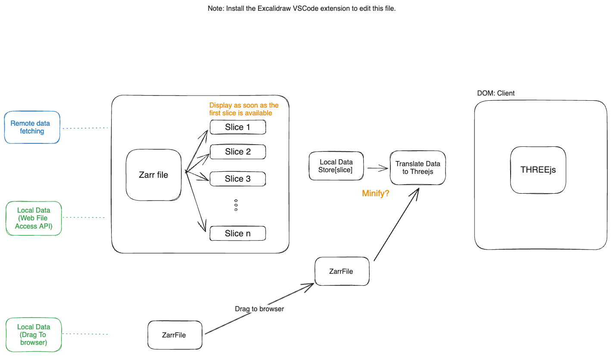

# Ruisdael on Display

Ruisdael Visualizer

# Documentation for developers

```bash
# install with
$ npm install

# Run with
$ npm run dev
```

Place the [ql.zarr] data file indisde the `/public/data` folder

## Technical Stack


Running on custom VPS. 
